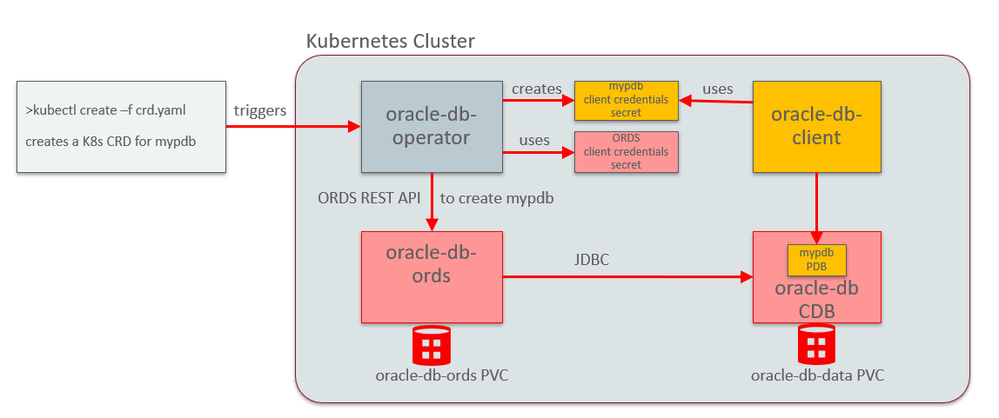
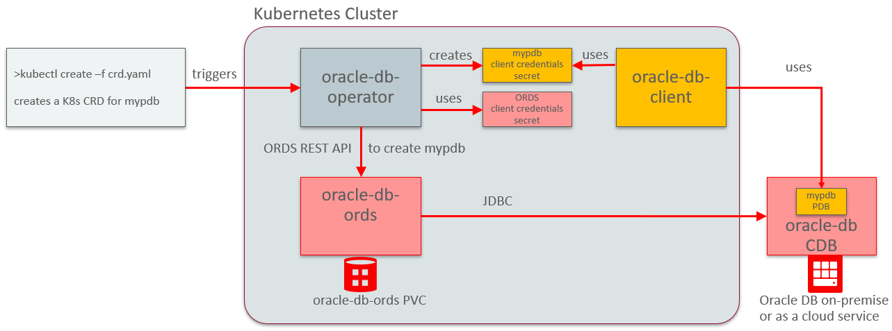

# oracle-pdb-operator

[](http://www.apache.org/licenses/LICENSE-2.0)

The oracle-db-operator implements a kubernetes native approach for lifecycle management of Oracle pluggable databases(PDB) inside of a Oracle container (multitenant) database(CDB), based on kubernetes operator and custom ressource definitions (CRD). It enables seamless integration of DevOps pipelines for microservices using Oralce polyglot databases, with Oracle autonomous database technology

## Architecture


*Scenario 1: Oracle DB running in a pod*

The Oracle container/multitenant database is shown in the picture as running in a k8s pod, which is fine for tests and development, but for production environments it will be running on-premise or as a cloud service:


*Scenario 2: Oracle DB running standalone*

In a DevOps scenario, first a custom ressource definition containing the configuration of a PDB would be created. This would trigger the oracle-db-operator to provision the PDB using a REST API call to ORDS, that will be forwarded to the container database. In parallel, a secret containing the PDB client credentials will be created. A database client app could then use this secret to communicate with the PDB. Similarly, the deletion of the CRD would lead to deletion of the PDB.

The oracle-db-operator implements a similar functionality to the [OCI Service Broker](https://github.com/oracle/oci-service-broker/) for Oracle database services in the cloud like autonomous database and data-warehouse, but it can also be used for on-premise scenarios.

The following describes an example deployment of Scenario 1 above in the Oracle Public Cloud, but with some minor changes noted below should work in any kubernetes cluster.

## Required Docker images

## Oracle Database

Build a docker image as described in https://github.com/oracle/docker-images/blob/master/OracleDatabase/SingleInstance/README.md. After cloning the git repository, download the database binaries in the version you need from [Oracle Technology Network](http://www.oracle.com/technetwork/database/enterprise-edition/downloads/index.html), put them in the dockerfiles/version folder, go in the dockerfiles direct0ry and execute e.g.:

```bash
./buildDockerImage.sh -e -v 19.3.0
```

Then tag the image and push it to your repo, e.g.:

```bash
docker tag oracle/database:19.3.0-ee harbor.pue.es/oraclepdo/oracle/database:19.3.0-ee
```

```bash
docker push harbor.pue.es/oraclepdo/oracle/database:19.3.0-ee
```

## Oracle Rest Data Services (ORDS)

Build a docker image as described in <https://github.com/oracle/docker-images/tree/master/OracleRestDataServices>. The Dockerfile for ORDS depends on an Oracle Java 8 docker image, which should be build first. This can be avoided if following statement in the Dockerfile

```bash
FROM oracle/serverjre:8
```

is replaced by

```bash
FROM openjdk:8
```

After cloning the git repository, download the ORDS binaries in the version you need from [Oracle Technology Network](http://www.oracle.com/technetwork/developer-tools/rest-data-services/downloads/index.html), put them in the dockerfiles/version folder(do not unzip!), go in the dockerfiles directory and execute e.g.:

```bash
./buildDockerImage.sh
```

Then tag the image and push it to your repo, e.g.:

```bash
docker tag oracle/restdataservices:20.2.1 harbor.pue.es/oraclepdo/oracle/restdataservices:20.2.1
```

```bash
docker push harbor.pue.es/oraclepdo/oracle/restdataservices:20.2.1
```

## Oracle Database Operator

The image can be downloaded from:

```bash
docker pull harbor.pue.es/oraclepdo/pueteam/oracle-pdb-operator:latest
```

To build the docker image, just run the `scripts/release.sh` . Clone this git repository, cd into it and execute:

```bash
./scripts/relase.sh
```

Then tag and push the docker image to your repository, e.g.:

```bash
docker tag oracle/oracle-pdb-operator:latest harbor.pue.es/oraclepdo/pueteam/oracle-pdb-operator:latest
```

```bash
docker push harbor.pue.es/oraclepdo/pueteam/oracle-pdb-operator:latest
```

## Deployment in a Kubernetes cluster

Please make sure to replace all occurrences of 'harbor.pue.es/oraclepdo/' in your local git repo clone with the appropriate prefix of your docker repository

Assuming you have already logged in to your docker repository, create a registry secret to hold the docker credentials for it, to be used in later deployments, e.g.:

```bash
kubectl create secret generic registry-secret --from-file=.dockerconfigjson=/home/opc/.docker/config.json --type=kubernetes.io/dockerconfigjson
```

Create configmap holding the sql script to provision the special database user for PDB lifecycle REST API:

```bash
kubectl create configmap oracle-db-config --from-file=examples/database/configmaps/
```

Create a persistence volume claim to hold Oracle database files and data:

```bash
kubectl create -f examples/database/oracle-db-persistent-storage.yaml
```

Deploy Oracle database:

```bash
kubectl create -f examples/database/oracle-db-deployment.yaml
```

This took around 10 min. on my machine. Check the logs to see that the database is configured and ready:

```bash
kubectl logs $(kubectl get pod -l app=oracle-db --output=jsonpath={.items..metadata.name})
...
Executing user defined scripts
/opt/oracle/runUserScripts.sh: running /opt/oracle/scripts/setup/init.sql
User created.
Grant succeeded.
DONE: Executing user defined scripts
The Oracle base remains unchanged with value /opt/oracle
#########################
DATABASE IS READY TO USE!
#########################
```

If an existing external CDB is used, as in Scenario 2, then the script examples/database/configmaps/init.sql should be executed on it. It creates a special CDB user with corresponding privileges, that is needed by ORDS for PDB life-cycle operations.

Create a config map for initial ORDS configuration:

```bash
kubectl create configmap oracle-db-ords-config --from-file=examples/ords/configmaps/
```

Create a persistence volume claim to hold ORDS config data:

```bash
kubectl create -f examples/ords/ords-persistent-storage.yaml
```

If the deployment is not on Oracle Public Cloud, the storageClassName in ords-persistent-storage.yaml should be changed from "oci" to "default" or the value supported by the used kubernetes implementation.

If an existing external CDB is used, as in Scenario 2, then some env vars in examples/ords/ords-deployment.yaml will have to be ajusted (e.g. ORACLE_HOST, ORACLE_SERVICE, ORACLE_PWD)

Deploy ORDS:

```bash
kubectl create -f examples/ords/ords-deployment.yaml
```

This could also take a minute. Check the log to see that ORDS is ready:

```bash
kubectl logs $(kubectl get pod -l app=oracle-db-ords --output=jsonpath={.items..metadata.name})
...
INFO: Configuration properties for: |apex|pu|
db.hostname=oracle-db-service
db.password=******
db.port=1521
db.servicename=ORCLCDB
db.username=ORDS_PUBLIC_USER
resource.templates.enabled=true
...
INFO: Oracle REST Data Services initialized
Oracle REST Data Services version : 19.2.0.r1991647
Oracle REST Data Services server info: jetty/9.4.z-SNAPSHOT
```

Create secret for ORDS client and its password:

```bash
kubectl create -f examples/ords/ords-credentials.yaml
```

Execute post-install.sh for ORDS to add the container database admin user, enable PDB lifecicle API and restart the pod to apply changes:

```bash
kubectl exec -it $(kubectl get pod -l app=oracle-db-ords --output=jsonpath={.items..metadata.name}) -- sh -c /opt/oracle/ords/config/ords/post-install.sh

kubectl delete pod $(kubectl get pod -l app=oracle-db-ords --output=jsonpath={.items..metadata.name})
```

Deploy Oracle database operator:

```bash
kubectl apply -f manifest/operator.yaml
```

If an existing external CDB is used, as in Scenario 2, then the value of DB_FILENAME_CONVERSION_PATTERN in manifest/operator.yaml should be changed to ('+DATA','+DATA')

Provision a test PDB mypdb, e.g.:

```bash
kubectl create -f examples/crd.yaml
```

Check that the pdb was created:

```bash
kubectl exec -it $(kubectl get pod -l app=oracle-db --output=jsonpath={.items..metadata.name}) -- bash -c "echo show pdbs|sqlplus / as sysdba"
...
Connected to:
Oracle Database 19c Enterprise Edition Release 19.0.0.0.0 - Production
Version 19.3.0.0.0
SQL>
    CON_ID CON_NAME                       OPEN MODE  RESTRICTED
---------- ------------------------------ ---------- ----------
         2 PDB$SEED                       READ ONLY  NO
         3 ORCLPDB1                       READ WRITE NO
         4 MYPDB                          READ WRITE NO
```

Create a test PDB client, e.g.:

```bash
kubectl create configmap oracle-db-client-config --from-file=examples/db-client/configmaps/

kubectl create -f examples/db-client/db-client.yaml
```

Check that the db-client has successfully connected mypdb:

```bash
kubectl logs $(kubectl get pod -l app=oracle-db-client --output=jsonpath={.items..metadata.name})
...
Connected to:
Oracle Database 19c Enterprise Edition Release 19.0.0.0.0 - Production
Version 19.3.0.0.0
SQL>
SYSDATE
---------
24-MAR-20
SQL> Disconnected from Oracle Database 19c Enterprise Edition Release 19.0.0.0.0 - Production
```

Delete the PDB created above:

```bash
kubectl delete oraclecdbservices.com.oracle mypdb
```

## Credits

This project is based on the ideas from <https://github.com/doschkinow/oracle-db-operator>
